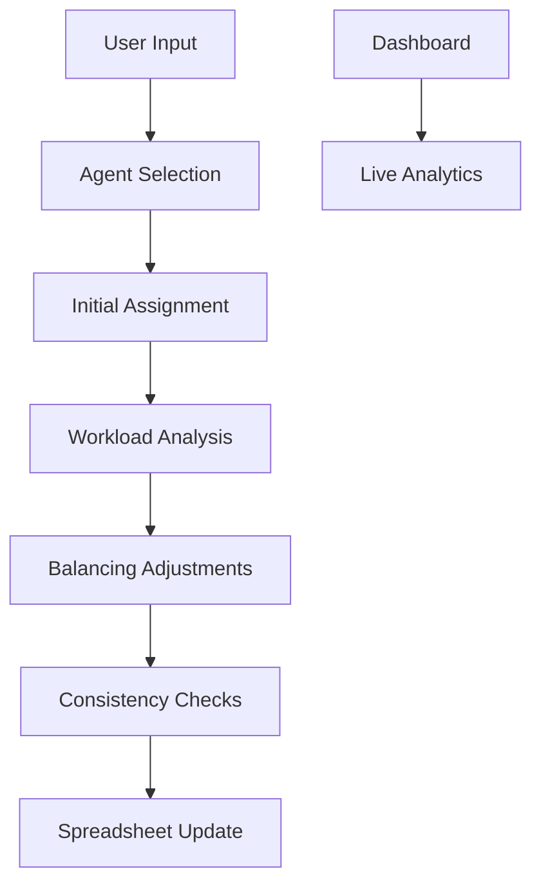

# Agent Assignment Automation Project  
**Efficiently manage agent workload distribution for food delivery platforms using advanced algorithms**

---

## Overview  
This Google Apps Script project automates agent assignment for food delivery platforms (currently Zomato & Swiggy) with intelligent workload balancing, consistency checks, and real-time analytics. Built with a focus on fairness and efficiency.

---

## Key Features  
✅ **Dynamic Agent Assignment**  
✅ **Workload Balancing Algorithm**  
✅ **Cross-Platform Support**  
✅ **Consistency Enforcement**  
✅ **Error Handling & Logging**  
✅ **Interactive Dashboard**

---

## Assignment Logic  
The system uses a **two-phase algorithm** for optimal distribution:

### Phase 1: Initial Assignment  
1. **Agent Selection**  
   - Filters active agents (✔) vs absent (✘)  
   - Prioritizes least loaded agents using:  
     ```javascript
     function getLeastLoadedAgent(availableAgents, agentLoad, metric) {
       return availableAgents.sort((a, b) => 
         agentLoad[a][metric] - agentLoad[b][metric]
       )[0];
     }
     ```

2. **Assignment Strategy**  
   - Type-based prioritization:  
     ```javascript
     function determineAgent(restType, count, availableAgents, agentLoad) {
       if (restType === "main") {
         return getLeastLoadedAgent(availableAgents, agentLoad, "main");
       } else if (restType === "virtual" && count === 1) {
         return getLeastLoadedAgent(availableAgents, agentLoad, "count1");
       }
     }
     ```

### Phase 2: Workload Balancing  
1. **Adjustment Process**  
   - Compares agent loads:  
     ```javascript
     while (agentCounts[agent].main > agentCounts[compareAgent].main + 1) {
       adjustSingleAssignment(assignData, agent, compareAgent, agentCounts);
     }
     ```

2. **Consistency Enforcement**  
   - Maintains RID-to-agent mapping:  
     ```javascript
     function ensureConsistentAssignments(assignData, platform) {
       const assignments = new Map();
       // First pass: Record assignments
       assignData.forEach(row => {
         const id = row[idColumn];
         const agent = row[agentColumn];
         if (id && agent) assignments.set(id, agent);
       });
       
       // Second pass: Enforce consistency
       assignData.forEach(row => {
         const id = row[idColumn];
         const agent = row[agentColumn];
         if (assignments.has(id) && assignments.get(id) !== agent) {
           row[agentColumn] = assignments.get(id); // Fix inconsistency
         }
       });
     }
     ```

---

## Technical Architecture  


---

## Usage Instructions  
1. **Agent Selection**  
   - Open sidebar via `Extensions > Assign Agents`  
   - Select active agents and confirm assignment  

2. **Platform Management**  
   - Supports parallel processing for Zomato/Swiggy  
   - Automatic column mapping:  
     | Platform | Agent Col | Type Col | ID Col |
     |----------|-----------|----------|--------|
     | Zomato   | L         | I        | A      |
     | Swiggy   | H         | A        | B      |

3. **Monitoring**  
   - Real-time dashboard shows:  
     - Total assignments per agent  
     - Virtual vs Main task breakdown  
     - Platform-wise statistics

---

## Advanced Capabilities  
🔍 **Smart Load Distribution**  
- Tracks 4 metrics per agent:  
  ```javascript
  { main: 0, virtual: 0, count1: 0, total: 0 }
  ```

🔄 **Auto-Balancing Mechanism**  
- Reassigns tasks when imbalance detected  
- Prevents overloading through dynamic adjustments  

📊 **Analytics Engine**  
- Detailed distribution statistics  
- Virtual task breakdown by count  

---

## Error Handling  
- Comprehensive logging system  
- Transaction rollback on failure  
- User-friendly error alerts  
- Audit trail with timestamps

---

## Contribution Guidelines  
1. Fork the repository  
2. Create feature branch (`git checkout -b feature/AgentBalance`)  
3. Commit changes (`git commit -am 'Add balancing algorithm'`)  
4. Push branch (`git push origin feature/AgentBalance`)  
5. Open pull request

---

## Acknowledgements  
Built using Google Apps Script with:  
- Material Design UI components  
- Async batch processing  
- State persistence via Script Properties
